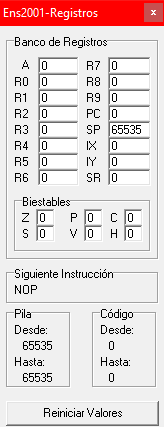

# Boreal Compiler – Language Translators Project

A university project developed for the Language Translators course, implementing a compiler that translates source code written in the [Boreal Language](https://dlsiis.fi.upm.es/traductores/IntroBoreal.html) into [ENS2001](https://dlsiis.fi.upm.es/traductores/Documentos/ENS2001.pdf) **object code**.

---

## Overview

- **Processor**: Validates source files (lexical, syntactic, and semantic analysis) and generates intermediate code (Java).

- **Translator**: Converts intermediate code (quadruples) into executable ENS2001 assembly (Python).

> **Note:** This implementation only covers:
>
> - The sentences ``IF-THEN`` and ``IF-THEN-ELSE``.
> - The minimum operator ``MIN``.
> - The procedures ``PROCEDURE`` with parameter passing by *value* and by *reference*.
> - The operators ``*``, ``AND`` and ``=`` (comparison operator, **not** assignment).
>
>⚠️ The *rest of the operators* are **not covered**.
>
>⚠️ No optimization is performed on the generated object code (assembly).
>
>⚠️ **The original Boreal language and the ENS2001 assembler materials may not be available temporarily.**
> 
>This post focuses on my implementation of the compiler, not on the distribution of the original materials. If you need to consult them, you can try accessing it later or search for archived versions.
>
> **Additional Note:** All the code in this implementation is written in Spanish, as the course was taught in Spanish. However, this shouldn't be a problem, as the concepts are explained in English.

---

## Usage

This section details the steps necessary to install dependencies, compile the project, and run each component.

### Installing Dependencies

To install the processor library (`ts-lib.jar`) into your local Maven repository, run the following command:

```powershell
mvn install:install-file -Dfile=".\lib\ts-lib.jar" -DgroupId=tslib -DartifactId=ts-lib -Dversion="1.0" -Dpackaging=jar
```

Or if you are on Linux or macOS:

```bash
mvn install:install-file -Dfile="./lib/ts-lib.jar" -DgroupId=tslib -DartifactId=ts-lib -Dversion="1.0" -Dpackaging=jar
```

### Compiling the Processor

Once the library is installed, build the processor executable with:

```powershell
mvn clean package
```

### Running the Processor

After compiling, you can run the processor with the following command (replace the path with that of your Boreal file):

```bash
java -jar .\target\tdl-1.0-SNAPSHOT-jar-with-dependencies.jar .\ruta\al\ficheroBoreal.txt
```

### Running the Translator

From the ``gco/`` folder, where the translator executable is located, run:

```powershell
.\_gco ..\tdl\src\test\resources\ficheroboreal.txt
```

Or if you are on Linux or macOS:

```bash
./_gco ../tdl/src/test/resources/ficheroboreal.txt
```

This will generate all the processor files as well as the ``cuartetos.txt`` (intermediate code) and ``codobj.ens`` (object code) files.

### Object code execution

To run the ``.ens`` file, you need to download the assembler (available in the [*Tools*](#tools) section), compile it, and execute it with the generated ``codobj.ens`` file.

---

## Execution

This section explains how to run the code generated by the translator, and shows an example to understand its behavior.

> **Note:** Only the Windows explanation is covered here, since on Linux the assembler lacks an interface and is less illustrative.

### Prerequisites

1. Ensure you have compiled the project (see [Usage](#usage) section).
2. Generated `codobj.ens` file (object code).

### Download

To do this, we need to download the assembler (available in the [Tools](#tools) section). After extracting the archive, we get a folder named `ENS2001-Windows` like the following:


Except for the `codobj.ens` file, which is the one we will assemble, the rest of the files come by default. Some examples and two files that are recommended to read are included: `readme.txt` and `bugs.txt`.

### Assembler

The assembler is the executable shown selected in the screenshot above (`winens`).

Once launched, you will see an interface like the following:


To clearly see what the assembler is doing, it is recommended to open the following windows:


- The **código fuente (source code) window** shows the order in which the object code instructions are executed. In this case, since no file has been loaded yet, all addresses are at `NOP`.

    

- The **registros (registers) window** shows the state of the machine registers.

    

- The **pila (stack) window** shows the contents of the data stack.

    

To load the `codobj.ens` file, go to `Archivo > Abrir y Ensamblar`. If everything goes well, it will tell you the assembly was successful:


Now we are ready to run the assembler. Pressing ▶️ will execute the assembler and show the result. If our code calls console output functions, the console will open. In this case, we assembled the file `expr.txt` (available in the `gco/` directory), and the result is as follows:


We enter a digit as requested and press enter.


We type our name:


After this, the program finishes its execution successfully.

---

## Tools

Both the language processor and the symbolic assemblers used to assemble the object code (ENS2001) are available at the following link:

>👉 <https://dlsiis.fi.upm.es/traductores/Herramientas.html>

For a more detailed explanation of the project you can visit my [*Blog*](https://azuar4e.github.io/en/posts/tdl/).
